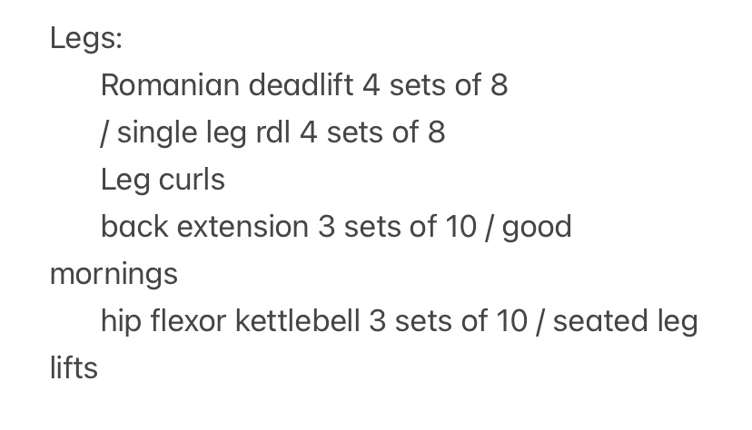
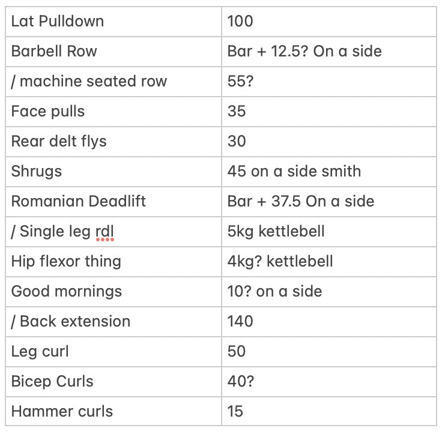

## Reasons I'm building this app

### The first reason

I've been going to the gym regularly for about two months now, and currently I keep track of my workouts using the Notes app on my phone.

The note I have keeps track of two things:

-   What exercises I should do on different days _(Right now I'm doing push-pull with legs on both days)_.
-   How much weight I can do for each exercise.

As I've gotten comfortable with certain exercises, I've been alternating between certain exercises on different days to work my muscles in slightly different ways.

	
	<figcaption class="caption">Exercises for my pull day</figcaption>

For example on my third pull day, I'll do the single leg version of romanian deadlifts instead of the normal version to build my stability.
The number of alternating exercises that I do have increased to the point where I can't keep track of all of the different versions that I need to be doing on different days in my head, so sometimes I've stopped alternating.

This is mental overhead that I realized I could save myself because, I'm a software dev! One of our favourite things is making stuff to solve our own problems!
So one of the reasons I want to build my own exercise tracker is to keep track of what exercises I need to do on a certain day, so I don't have to.

### The second reason

The other purpose of the note I have is to keep track of the different weights I use for each exercise.

	
	<figcaption class="caption">Weights for my pull day</figcaption>

I keep track of if I should add more weight next time by putting a question mark next to the weight.
For example, next time I do bicep curls I should try 50 instead of 40 pounds.
This method of keeping track of weights has worked well for me, but it has one flaw.
I can only see if I should increase whatever my current weight is for an exercise, but I can't see when I last increased my weight _(I know that I can use the undo feature on the Notes app to see past changes, but I can't see line-by-line changes easily, and again my goal is decreasing mental overhead :) )_.
This is useful to me as I would like to know how long I've stayed at a certain weight so I can have an idea of how much I'm getting stronger over time.

So the second reason I want to build my own exercise tracker is to have a better way of _visualizing_ how much I've increased my weights over time.

## What I want to build

The app should have the following features at a minimum:

-   A way to add exercises to different days, and to keep track of what exercises I should do on a certain day.
-   A way to add weights to exercises, and to keep track of when I last increased the weight for an exercise.
-   A way to generate graphs of every exercise I've done, to see how much I've increased the weight over time.

As I have an iPhone, I'll be building this app for iOS, using Swift and SwiftUI.
One of my goals for this app is to learn more about SwiftUI, as I've never used it before.
This app should be a good way to learn about SwiftUI, as it's a relatively simple app that I can build in my free time.
I can tailor the app to my needs, and I can add features as I see fit, which is always fun.

I'll be writing about my progress on this app in future posts, so stay tuned!
