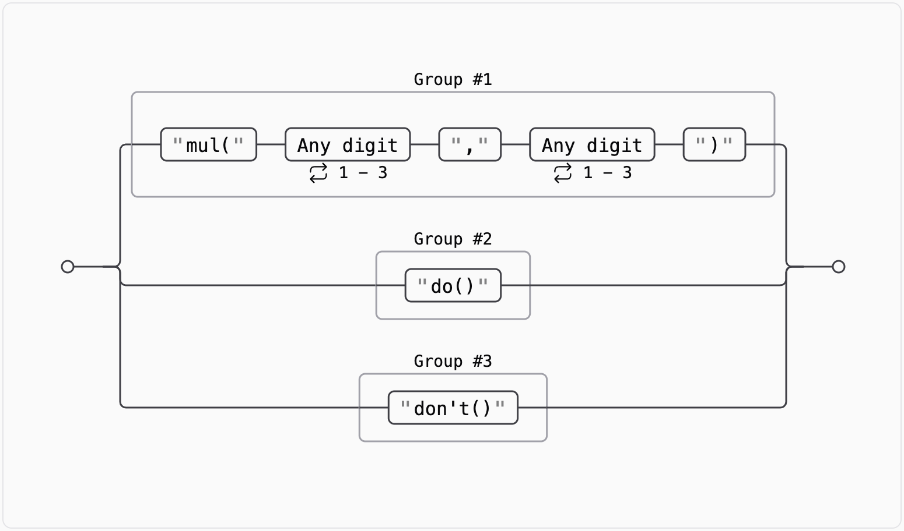

# Day 3: [Mull It Over](https://adventofcode.com/2024/day/3)

## Part 1 {#Part1}

Today's puzzle is called "Mull It Over". The input for today's puzzle is a file
where the lines represent corrupted memory, with uncorrupted instructions and
corrupted instructions. This is the example input that was given.

```plaintext
xmul(2,4)%&mul[3,7]!@^do_not_mul(5,5)+mul(32,64]then(mul(11,8)mul(8,5))
```

The instructions we need to look for in the memory are `mul(X,Y)` where `X` and
`Y` are 1-3 digit numbers. `mul(X,Y)` takes two arguments, `X` and `Y`, and
returns the product of `X` and `Y`. In the example, there are four uncorrupted
instructions: `mul(2,4)`, `mul(5,5)`, `mul(11,8)`, and `mul(8,5)`.

Our task is to find the sum of the products of the `X` and `Y` values in the
uncorrupted instructions.

### My Solution {#Part1Solution}

For my solution, the simplest way that I could think of to extract the
uncorrupted instructions is to use a regular expression to match the `mul(X,Y)`
pattern.

```python
import re

def get_result1(line: str) -> int:
    # Search for mul(a,b) in the line,
    # Group 1: a, Group 2: b
    pattern = r"mul\((\d{1,3}),(\d{1,3})\)"
    matches = re.finditer(pattern, line)

    return sum(int(match.group(1)) * int(match.group(2)) for match in matches)
```

Breaking down the code:

- `pattern = r"mul\((\d{1,3}),(\d{1,3})\)"` This is a regular expression pattern
  that matches the `mul(X,Y)` pattern.
  - `r` before the string indicates a
    [raw string](https://www.geeksforgeeks.org/python-raw-strings/), which is
    useful for regular expressions, where backslashes are often used.
  - `mul\(` Matches the literal string `mul(`.
  - `(\d{1,3})` Matches 1-3 digits and captures them into group 1.
  - `,`: Matches the comma separating the two numbers.
  - `(\d{1,3})` Matches 1-3 digits and captures them into group 2.
  - `\)` Matches the closing parenthesis.
- `matches = re.finditer(pattern, line)` Find all matches of the pattern in the
  line, returning an iterator of match objects. I prefer using `re.finditer`
  over `re.findall` because it returns an
  [iterator](https://docs.python.org/3/glossary.html#term-iterator) while
  `re.findall` returns a list of match objects. Iterators are lazy; i.e. they
  only return the next element in the sequence or list when asked to do so,
  which is good when the number of elements are unknown.
- `return sum(int(match.group(1)) * int(match.group(2)) for match in matches)`:
  - `match.group(1)` and `match.group(2)` return the values of the first and
    second captured groups in the match object, which are the `X` and `Y`
    values.
  - `int(match.group(1)) * int(match.group(2))` calculates the product of the
    two numbers.
  - `for match in matches` iterates over the match objects returned by
    `re.finditer`.
  - `sum(...)` calculates the sum of the products of the `X` and `Y` values in
    the uncorrupted instructions.

I've only included the relevant parts of the code here, but to see my full
solution, you can check out my
[Advent of Code GitHub repository](https://github.com/VBenny42/AoC/blob/main/2024/day03/solution.py).

## Part 2 {#Part2}

For part 2, there are additional instructions in the corrupted memory that we
need to consider.

There are now 2 new instructions to handle:

- `do()`: This instruction enables future `mul(X,Y)` instructions.
- `don't()`: This instruction disables future `mul(X,Y)` instructions.

At the beginning of the memory, `mul` instructions are enabled.

Looking at a new example input:

```plaintext
xmul(2,4)&mul[3,7]!^don't()_mul(5,5)+mul(32,64](mul(11,8)undo()?mul(8,5))
```

Breaking down the instructions in the example:

- `mul(2,4)` is enabled and is a valid instruction.
- `don't()` disables future `mul` instructions.
- `mul(5,5)` is not considered as instructions are disabled.
- `mul(11,8)` is not considered as instructions are disabled
- `do()` enables future `mul` instructions.
- `mul(8,5)` is enabled and is a valid instruction.
- Final sum: `2*4 + 8*5 = 48`.

Our task is to find the sum of the products of the `X` and `Y` values in the
uncorrupted instructions, considering the new conditional instructions.

### My Solution {#Part2Solution}

To solve part 2, my regex pattern needs to be updated to handle the new
conditional instructions.

```python
pattern = r"mul\((\d{1,3},\d{1,3})\)|(do\(\))|(don't\(\))"
```

<div>
    <div style="margin-bottom: 15px;">
        <figcaption class="caption">Graphic from <a href="https://regex-vis.com/?r=%28mul%5C%28%5Cd%7B1%2C3%7D%2C%5Cd%7B1%2C3%7D%5C%29%29%7C%28do%5C%28%5C%29%29%7C%28don%27t%5C%28%5C%29%29">regex-vis.com</a></figcaption>
    </div>
    
</div>

Explanation of the updated pattern:

- `mul\((\d{1,3},\d{1,3})\)` matches the `mul(X,Y)` pattern, like in part 1, but
  instead of capturing `X` and `Y` separately, it captures them together as a
  single group.
- `|` is the
  [alternation](https://www.regular-expressions.info/alternation.html) operator,
  which allows matching either the left or right side of the `|`.
- `(do\(\))` matches the `do()` instruction, and captures it into group 2.
- `(don't\(\))` matches the `don't()` instruction, and captures it into group 3.

So this pattern will match either the `mul(X,Y)` instruction, `do()`, or
`don't()`.

Now, let's update the `get_result2` function to handle the new instructions.

```python
def get_result2(line: str) -> int:
    pattern = r"mul\((\d{1,3},\d{1,3})\)|(do\(\))|(don't\(\))"
    matches = re.finditer(pattern, line)

    sum = 0
    enabled = True
    for match in matches:
        if match.group(1) and enabled:
            a, b = map(int, match.group(1).split(","))
            sum += a * b
        elif match.group(2):
            enabled = True
        elif match.group(3):
            enabled = False
    return sum
```

Breaking down the code:

- `pattern = r"mul\((\d{1,3},\d{1,3})\)|(do\(\))|(don't\(\))"` This is the
  updated regular expression pattern that matches the `mul(X,Y)`, `do()`, and
  `don't()` instructions.
- `matches = re.finditer(pattern, line)` Find all matches of the pattern in the
  line, returning an iterator of match objects.
- `sum = 0` Initialize the sum of the products of the `X` and `Y` values.
- `enabled = True` Initialize the `enabled` flag to `True` to enable future
  `mul` instructions, since the memory starts with `mul` instructions enabled.
- `for match in matches` Iterate over the match objects returned by
  `re.finditer`.
- `if match.group(1) and enabled:` If the match is a `mul(X,Y)` instruction
  _and_ `enabled` is `True`, perform the multiplication. If `enabled` is
  `False`, the `mul` instruction is ignored, since the most recent conditional
  must have been `don't()`. - `a, b = map(int, match.group(1).split(","))` Split
  the `X,Y` values and convert them to integers.
- `elif match.group(2):` If the match is a `do()` instruction, enable future
  multiplication.
- `elif match.group(3):` If the match is a `don't()` instruction, disable future
  multiplication.

This code will go through all the instructions in the memory, considering the
conditional instructions to calculate the sum of the products of the `X` and `Y`
values in the uncorrupted instructions.

---

That's it for day 3 of Advent of Code 2024! I hope you enjoyed reading my
solution and let's see how the rest of the month goes!
