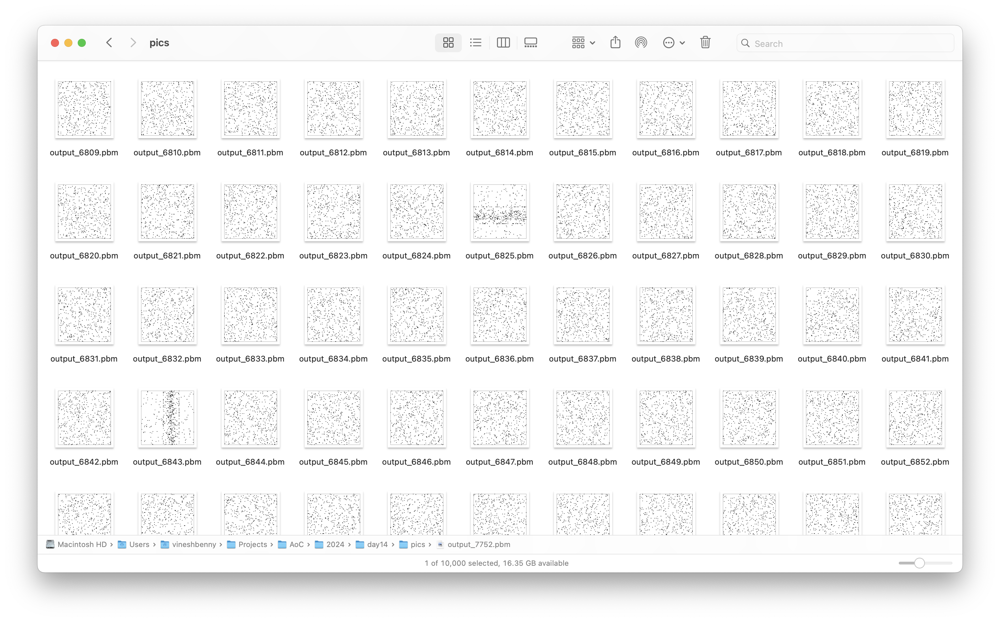
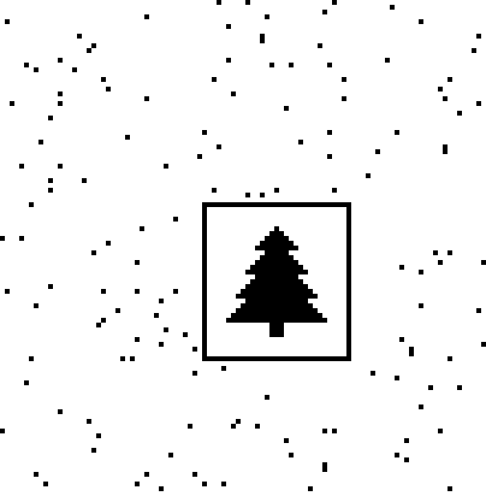

# Day 14: [Restroom Redoubt](https://adventofcode.com/2024/day/14)

## Part 1 {#Part1}

For today's puzzle, there's a room with robots, and we need to predict their
movement in the future. Fortunately, our input lists all the robots, with their
starting position and their velocity. After every second, they will move
according to their velocity. Whenever a robot meets an edge of the room, they
can teleport to the opposite edge, wrapping around the room. Also, multiple
robots can occupy the same position at the same time, without any issues.

Looking at a room `11` tiles wide and `7` tiles tall, and one robot with the
following characteristics `p=2,4 v=2,-3`:

```
Initial state:
...........
...........
...........
...........
..1........
...........
...........

After 1 second:
...........
....1......
...........
...........
...........
...........
...........

After 2 seconds:
...........
...........
...........
...........
...........
......1....
...........

After 3 seconds:
...........
...........
........1..
...........
...........
...........
...........

After 4 seconds:
...........
...........
...........
...........
...........
...........
..........1

After 5 seconds:
...........
...........
...........
.1.........
...........
...........
...........
```

---

Given this sample input:

```
p=0,4 v=3,-3
p=6,3 v=-1,-3
p=10,3 v=-1,2
p=2,0 v=2,-1
p=0,0 v=1,3
p=3,0 v=-2,-2
p=7,6 v=-1,-3
p=3,0 v=-1,-2
p=9,3 v=2,3
p=7,3 v=-1,2
p=2,4 v=2,-3
p=9,5 v=-3,-3
```

After `100` seconds, the room looks like this:

```
......2..1.
...........
1..........
.11........
.....1.....
...12......
.1....1....
```

We need to count all the robots in each quadrant of the room and multiply them
to find the _safety factor_ of the room. Robots that are exactly in the middle
(horizontal or vertical) are not counted, so the robots to check are.

```
..... 2..1.
..... .....
1.... .....
           
..... .....
...12 .....
.1... 1....
```

The quadrants have `1`, `3`, `1` and `4` robots, so the safety factor for this
room is `12`.

Our task is to find the safety factor of a room that is `101` tiles wide and
`101` tiles tall after `100` seconds.

### My Solution {#Part1Solution}

Let's start with some pseudocode to solve this problem:

- Parse the input to get the robots' positions and velocities.
- Initialize an empty grid to represent the room.
- Put the robots in their initial positions on the grid.
- For each second, move the robots according to their velocities.
- Count the robots in each quadrant of the room.
- Multiply the counts to get the safety factor.

Parsing the input:

```python
def parse_robot(line: List[str]):
    position = list(map(int, line[0][2:].split(",")))
    velocity = tuple(map(int, line[1][2:].split(",")))
    return [position, velocity]

with open("input.txt", "r") as f:
	robots = [parse_robot(line.strip().split()) for line in f]
```

This function will parse every input line and return a list with the robot's
beginning position and velocity.

Initializing the grid:

```python
rows = 103
cols = 101
room = [[0 for _ in range(cols)] for _ in range(rows)]
```

Putting the robots in their initial positions:

```python
def initialize_robot(room, robot):
    x, y = robot[0]
    room[y][x] += 1
```

Moving a robot according to its velocity:

```python
def move_robot(robot, room, rows, cols):
    v_x, v_y = robot[1]
    p_x, p_y = robot[0]
    new_x = (p_x + v_x) % cols
    new_y = (p_y + v_y) % rows
    room[p_y][p_x] -= 1
    room[new_y][new_x] += 1
    robot[0] = [new_x, new_y]
```

I set the new position of the robot to be the current position plus the velocity
and then modulo the width and height of the room to wrap around the edges. Once
the robot is moved, I update the room grid accordingly.

I made a helper function to get each quadrant of the room:

```python
def get_quadrant(room, quadrant):
    rows, cols = len(room), len(room[0])
    match quadrant:
        case quadrant.TOP_LEFT:
            return [[room[y][x] for x in range(cols // 2)] for y in range(rows // 2)]
        case quadrant.TOP_RIGHT:
            return [
                [room[y][x] for x in range(cols // 2 + 1, cols)]
                for y in range(rows // 2)
            ]
        case quadrant.BOTTOM_LEFT:
            return [
                [room[y][x] for x in range(cols // 2)]
                for y in range(rows // 2 + 1, rows)
            ]
        case quadrant.BOTTOM_RIGHT:
            return [
                [room[y][x] for x in range(cols // 2 + 1, cols)]
                for y in range(rows // 2 + 1, rows)
            ]
```

I then counted the robots in each quadrant:

```python
safety_factor = 1
for quadrant in Quadrants:
	room_quadrant = get_quadrant(room, quadrant)
	num_robots = sum(sum(row) for row in room_quadrant)
	safety_factor *= num_robots
```

Finally, I put everything together in a loop to simulate the robots' movement
after `100` seconds:

```python
def main1():
    with open("input.txt", "r") as f:
        robots = [parse_robot(line.strip().split()) for line in f]
    rows = 103
    cols = 101
    room = [[0 for _ in range(cols)] for _ in range(rows)]
    for robot in robots:
        initialize_robot(room, robot)
        for _ in range(100):
            move_robot(robot, room, rows, cols)
    safety_factor = 1
    for quadrant in Quadrants:
        room_quadrant = get_quadrant(room, quadrant)
        num_robots = sum(sum(row) for row in room_quadrant)
        safety_factor *= num_robots
    print(f"LOGF: { safety_factor = }")
```

As always, I've only included the relevant parts of the code here, but to see my
full solution, you can check out my
[Advent of Code GitHub repository](https://github.com/VBenny42/AoC/blob/main/2024/python/day14/solution.py).

## Part 2 {#Part2}

For part 2, we learn that at some point in the future, the robots will form a
Christmas tree shape. We need to find the earliest time this will happen.

### My Solution {#Part2Solution}

Given that we don't know how many seconds it will take for the robots to form a
Christmas tree shape I needed to pick an upper bound to iterate until. I
submitted `10000` as the answer first on the website, where it was too high, so
I know my answer appears before `10000` seconds.

I checked the room after every second by saving the room as a bitmap, that I
could quickly look over to find the Christmas tree. I wrote a helper function to
save the room as a bitmap:

```python
def print_bitmap(room, rows, cols, filename):
    with open(filename, "w") as f:
        f.write(f"P1\n{cols} {rows}\n")
        for row in range(rows):
            for col in range(cols):
                f.write(str(room[row][col]))
            f.write("\n")
```

This function will write the room to a file in the
[PBM](https://en.wikipedia.org/wiki/Netpbm#PBM_example) format, which just has
black and white cells.

Running the simulation:

```python
def main2():
    with open("input.txt", "r") as f:
        robots = [parse_robot(line.strip().split()) for line in f]
    rows = 103
    cols = 101
    room = [[0 for _ in range(cols)] for _ in range(rows)]
    for robot in robots:
        initialize_robot(room, robot)
    for i in range(10000):
        for robot in robots:
            move_robot(robot, room, rows, cols)
        print_bitmap(room, rows, cols, f"pics/output_{i+1}.pbm")
```

<div>
	
	<figcaption class="caption">As you can see, there are a <em>lot</em> of bitmaps to look over.</figcaption>
</div>

Even though this approach isn't programmatically checking for the Christmas
tree, it only took me a minute to find the correct bitmap because I was able to
look over about 50 pictures at a time. I then checked the time outputted in the
filename to find the earliest time the robots formed the tree. Here's the tree
bitmap in all its glory:

<div class="side-by-side">
	<div class="toleft">
		<div style="text-align: center;">
			
		</div>
	</div>

    <div class="toright">
    	<div style="text-align: center;">
    		
    	</div>
    </div>
    <figcaption class="caption">Actual bitmap of the Christmas tree on the left, and the inverted bitmap on the right.</figcaption>

</div>

Today's puzzle was a fun one, and I enjoyed the visual aspect of it. The creator
must have had a lot of fun designing this puzzle and generating inputs. I'm
looking forward to the next one!

Again, I've only included the relevant parts of the code here, check out my
[repository](https://github.com/VBenny42/AoC/blob/main/2024/python/day14/solution.py)
for the full solution.

---

That's it for day 14 of Advent of Code 2024! I hope you enjoyed reading my
solution and let's see how the rest of the month goes!
