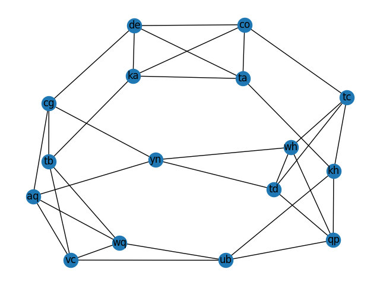

# Day 23: [LAN Party](https://adventofcode.com/2024/day/23)

## Part 1 {#Part1}

For today's puzzle there's a LAN party happening and we want to find someone
that's in the party. Our input is a list of every connection between _two_
computers in the party. For example:

```
kh-tc
qp-kh
de-cg
ka-co
yn-aq
qp-ub
cg-tb
vc-aq
tb-ka
wh-tc
yn-cg
kh-ub
ta-co
de-co
tc-td
tb-wq
wh-td
ta-ka
td-qp
aq-cg
wq-ub
ub-vc
de-ta
wq-aq
wq-vc
wh-yn
ka-de
kh-ta
co-tc
wh-qp
tb-vc
td-yn
```

Each line represents a connection between two computers. For example, the first
line `kh-tc` means that computer `kh` is connected to computer `tc`. Since the
connections are _bidirectional_, the connection `tc-kh` would mean the same
thing.

There are multiplayer games happening on the LAN party and we know the person we
want to find is in a room. We need to find sets of `3` computers where every
computer is connected to the other two to find these rooms. In this example,
there are `12` such rooms:

```
aq,cg,yn
aq,vc,wq
co,de,ka
co,de,ta
co,ka,ta
de,ka,ta
kh,qp,ub
qp,td,wh
tb,vc,wq
tc,td,wh
td,wh,yn
ub,vc,wq
```

We know that the person we want to find has a computer name that starts with
`t`, so we can filter out the rooms that don't have a computer starting with
`t`. In this case, we're left with `7` rooms:

```
co,de,ta
co,ka,ta
de,ka,ta
qp,td,wh
tb,vc,wq
tc,td,wh
td,wh,yn
```

Our task is to find all the sets of `3` interconnected computers and then find
out how many of these sets have a computer starting with `t`.

### My Solution {#Part1Solution}

This is actually a
[clique problem](https://en.wikipedia.org/wiki/Clique_problem), which I first
encountered when looking at NP-complete problems. I know how to solve this
problem from my algorithms class, _but_ I can also use well-known libraries that
already have implementations for this problem. The library I'm going to use is
[networkx](https://networkx.org/), which is a library for creating,
manipulating, and studying complex networks.

I need to create a graph where each line in the input is an edge between two
nodes. I can then use the library to find all the cliques of size `3` in the
graph. Then I can sum up the number of cliques that have a node starting with
`t`.

```python
def main1():
    G = nx.Graph()
    with open("input.txt", "r", encoding="utf-8") as f:
        for line in f:
            u, v = line.strip().split("-")
            G.add_edge(u, v)

    triangles = []
    for clique in nx.enumerate_all_cliques(G):
        if len(clique) == 3:
            triangles.append(clique)
        if len(clique) > 3:
            break

    triangles_with_t = sum(
        1 for triangle in triangles if any(node.startswith("t") for node in triangle)
    )

    # Print results
    print(f"ANSWER1: {(triangles_with_t)}")
```

Explanation:

- I create a graph `G` using `nx.Graph()`.
- I read the input file and add each edge to the graph.
- `for clique in nx.enumerate_all_cliques(G):` iterates over all the cliques in
  the graph. `enumerate_all_cliques` is an iterator that yields all the cliques
  of size `1` to `n` in the graph. After finding all the cliques of size `3`, I
  break out of the loop, as I don't need to find any more cliques.
- I count the number of cliques that have a node starting with `t` and print the
  result.

As always, I've only included the relevant parts of the code here, but to see my
full solution, you can check out my
[Advent of Code GitHub repository](https://github.com/VBenny42/AoC/blob/main/2024/python/day23/solution.py).

## Part 2 {#Part2}

For part 2, we need to find the largest room in the LAN party. This would be the
largest set of computers that are all interconnected. To get into the room, we
need a password, which is the the name of every computer in the room, sorted
alphabetically and concatenated together with commas in between. The largest
room in the example is

```
ka-co
ta-co
de-co
ta-ka
de-ta
ka-de
```

with a size of `4`, and the password for this room would be `co,de,ka,ta`.

<div style="text-align: center;">
    
    <div style="margin-bottom: 15px;">
        <figcaption class="caption">Computer network visualised</figcaption>
    </div>
</div>

Our task is to find the password for the largest room in the LAN party.

### My Solution {#Part2Solution}

I can use the same library and the same graph I created in part 1 to solve this.
I just need to find the largest clique in the graph and then sort its nodes
alphabetically.

```python
def main2():
    G = nx.Graph()
    with open("input.txt", "r", encoding="utf-8") as f:
        for line in f:
            u, v = line.strip().split("-")
            G.add_edge(u, v)

    max_clique = max(nx.find_cliques(G), key=len)
    max_clique = ",".join(sorted(max_clique))
    print(f"ANSWER2: { max_clique }")
```

Again, I've only included the relevant parts of the code here, check out my
[repository](https://github.com/VBenny42/AoC/blob/main/2024/python/day23/solution.py)
for the full solution.

---

That's it for day 23 of Advent of Code 2024! I hope you enjoyed reading my
solution and let's see how the rest of the month goes!
